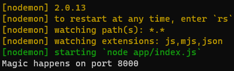
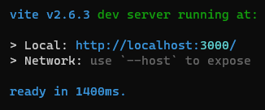

# Project 12 - OpenClassrooms Front-end path

## General information

This application uses [ViteJS](https://vitejs.dev/).

This repo contains the codebase for the SportSee analytic dashboard web application.

It needs to get .JSON data from the [API](https://github.com/TriupLauro/P12-API-Front-End).

## Prerequisites

You need to have installed [NodeJs](https://nodejs.org/en/).

You could either use **npm** (which comes with NodeJS) or install [**yarn (classic)**](https://classic.yarnpkg.com/lang/en/)
for dependencies management and for running both the API and the app.

You need the **classic** version of yarn (version that starts with the number 1). 
To manage multiple versions fo yarn under macOS or linux you can use [yvm (Yarn Version Manager)](https://yvm.js.org/docs/overview)

## Installing the codebase

### Installing the API

First you need to have the API running.

Clone it on your computer in a directory of your choice.

- `git clone https://github.com/TriupLauro/P12-API-Front-End`
- or clone it with your IDE

Go to the API folder

`cd P12-API-Front-End`

Install the dependencies
- with npm `npm install`
- or with yarn `yarn install`

### Installing the APP itself

Go back to the parent folder (or another folder of your choice)

`cd ..`

Clone this repository, with another terminal window (or with your IDE) in another folder.

- `git clone https://github.com/TriupLauro/KestelmanValentin_12_30092021.git`
- or clone it with your IDE

Go to the app folder 

`cd KestelmanValentin_12_30092021`

Install the dependencies

- with npm `npm install`
- or with yarn `yarn install`

## Launching

### Launching the API

Go to the folder containing the API, and launch it :
- `npm run dev`
- or `yarn dev`

You should see the following message :

### Launching the app

Without exiting or closing the terminal with the above screen,
go to the folder containing the app, and launch it :
- `npm run dev`
- or `yarn dev`

You should see the following screen : 

Once you have both terminal active you can go to :

`http://localhost:3000/`

The application should be displayed (it may take a few seconds).